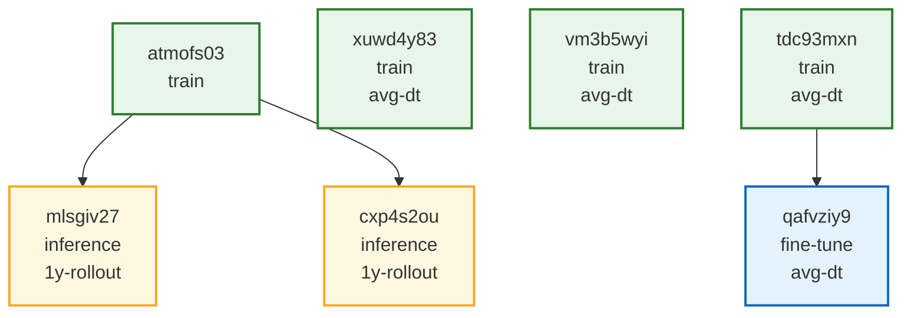

# run-id-tracker
Track run-IDs in a convenient way

## Track your run-ids in `runs.csv`
For each run that you want to track, add a new column in `runs.csv` and associate with the run type (`train`, `fine-tune` or `inference`) and the parent run, if present. The runs can also be categorized


## Render mermaid diagram
A mermaid diagram shows how the different runs are connected, and is generated by running

```bash
python mermaid_diagram.py
```

It generates a markdown file, `run_lineage.md` that can be opened in any markdown reader that supports mermaid:

