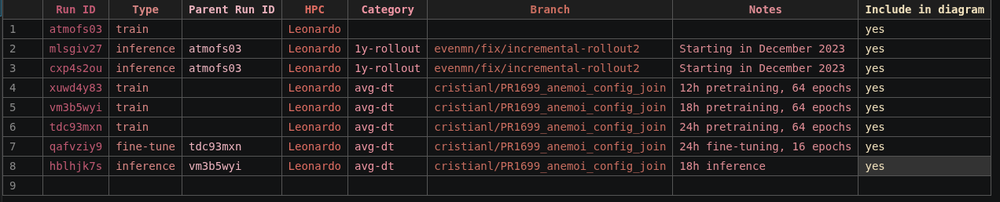
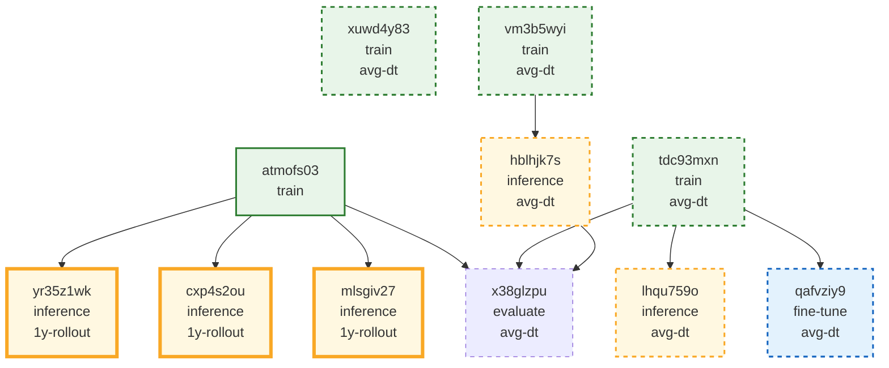

# run-id-tracker
Track run-IDs in a convenient way

## Track your run-ids in `runs.csv`
For each run that you want to track, add a new column in `runs.csv` and associate with the run type (`train`, `fine-tune` or `inference`) and the parent run, if present. The runs can also be categorized

<!--  -->

<!-- RUN_TABLE_START -->
| Run ID | Type | Category | Notes |
| --- | --- | --- | --- |
| atmofs03 | train |  |  |
| mlsgiv27 | inference | 1y-rollout | Starting in December 2023 |
| cxp4s2ou | inference | 1y-rollout | Starting in December 2023 |
| yr35z1wk | inference | 1y-rollout | Starting in December 2023 |
| xuwd4y83 | train | avg-dt | 12h pretraining, 64 epochs |
| vm3b5wyi | train | avg-dt | 18h pretraining, 64 epochs |
| tdc93mxn | train | avg-dt | 24h pretraining, 64 epochs |
| qafvziy9 | fine-tune | avg-dt | 24h fine-tuning, 16 epochs |
| hblhjk7s | inference | avg-dt | 18h inference, |
| lhqu759o | inference | avg-dt | 24h inference |
| x38glzpu | evaluate | avg-dt | 18h evaluation |
<!-- RUN_TABLE_END -->

## Render mermaid diagram
A mermaid diagram shows how the different runs are connected, and is generated by running

```bash
python mermaid_diagram.py
```

It generates a markdown file, `run_lineage.md` that can be opened in any markdown reader that supports mermaid:

<!-- RUN_LINEAGE_START -->

<!-- RUN_LINEAGE_END -->

<!--

-->